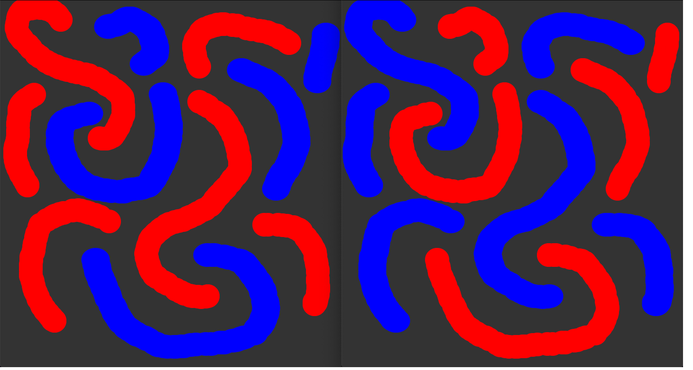

# Collaborative Drawing with Websockets

1. In terminal, run `npm install`
2. Run `npm start`
3. Open two browser-windows by navigating to `localhost:3000`
4. Start to draw!




## NPM Dependencies

```
"dependencies": {
  "express": "^4.17.1",
  "socket.io": "^2.3.0"
}
```

## Coding Train Tutorial

- [https://www.youtube.com/watch?v=i6eP1Lw4gZk](https://www.youtube.com/watch?v=i6eP1Lw4gZk)